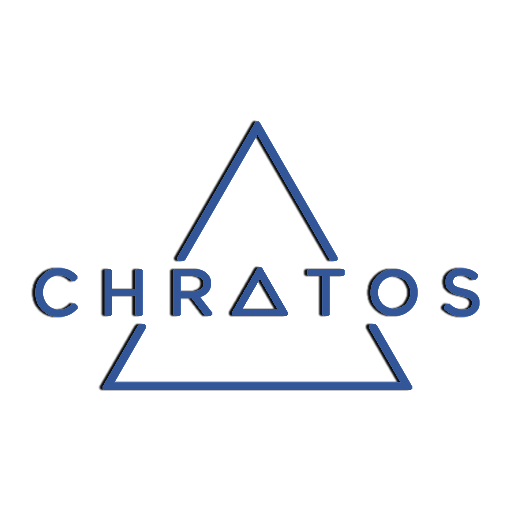

This is the working repository for  Chratos

For more information please visit the website:

https://chratos.io

## Coin Specifications

| Specification | Value |
|:-----------|:-----------|
| Block Spacing | `2 minutes` |
| Stake Minimum Age | `4 hours` |
| Stake Reward | `12 halving every x years` |
| Port | `9123` |
| RPC Port | `9124` |

License
---------------------
Distributed under the [MIT software license](http://www.opensource.org/licenses/mit-license.php).
